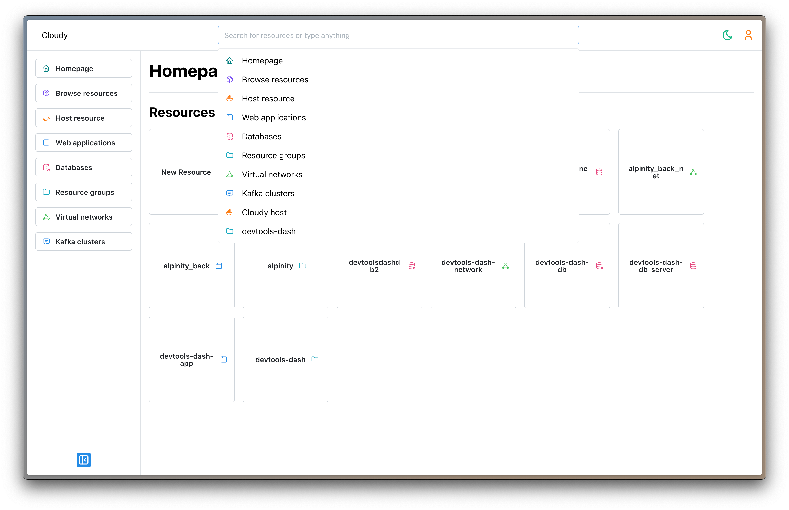
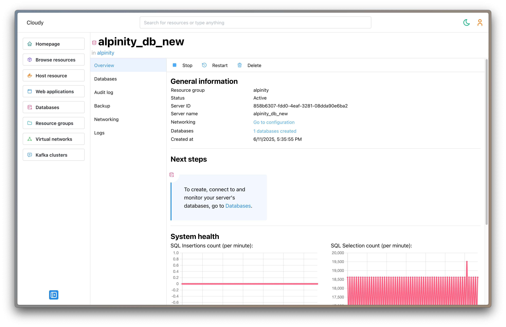
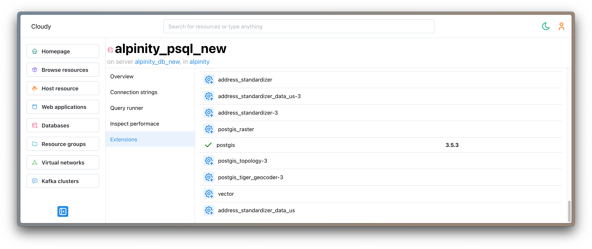
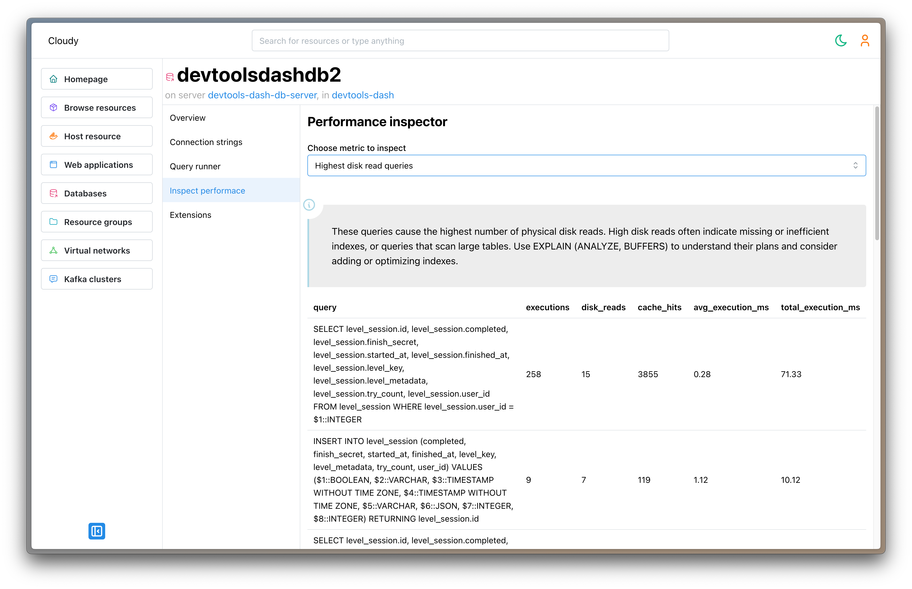
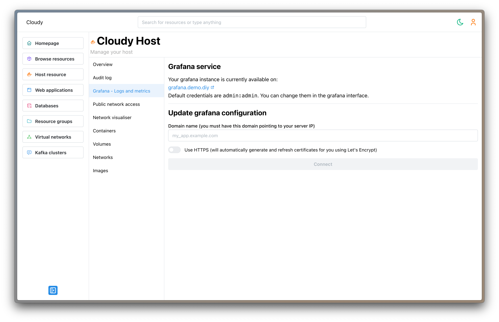
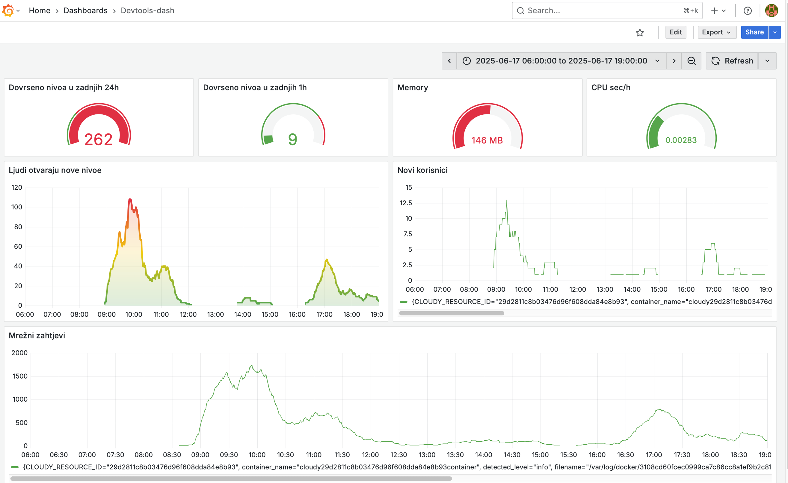

# personal-cloud
Cloud platform inspired self hosted service hosting panel. Offering managed resources such as databases and message brokers, and other resources like web-applications and virtual networks 

## Abstract
This thesis focuses on the study, implementation, and analysis of a system for managing application infrastructure.
A system was developed using a "managed resources" model, in which the system assumes control over the maintenance and
deployment of resources, while providing the user with the minimum privileges necessary for operation.
Testing on real-world systems and with users has demonstrated that the implemented system successfully fulfills its
objective, while also identifying clearly defined areas for improvement.

## Screenshots

### Homepage

We can see the list of most recently created resources, the navbar with resource types for navigation and the global search bar.

### Resource Management

When entering single resource (in this example postgres database server), we can see the resource overview.

### Database resource tool - PostgreSQL Extension manager

We can activate postgres extensions on specific database resource. The system comes with postgis adn pgvector preinstalled for activation. 

### Database resource tool - Performance Inspector

We can observe longest running queries, slow queries and other performance metrics of the database. This is collected using pre-included pg_stat_statements extension.

### Grafana integration

System administrator can activate Grafana service, with preconfigured datasource for the system's Loki and Prometheus instances.

#### Using grafana

See how to utilize the grafana in action for beautiful dashboards of your data.

